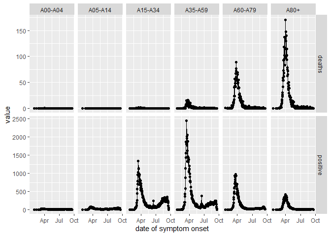

<!-- README.md is generated from README.Rmd. Please edit that file -->

# CovidGer

<!-- badges: start -->

<!-- badges: end -->

The goal of CovidGer is to provide relatively easy access to the data
used in “Inference under superspreading” by Patrick Schmidt.

The repository contains additional code on the generation of the data
files in the data-raw folder.

## Installation

You can install the development version from
[GitHub](https://github.com/) with:

``` r
# install.packages("devtools")
devtools::install_github("Schmidtpk/CovidGer")
```

## Example: Case data by the rki

This is a basic example which shows you how to use the case data by the
rki. See `?rki_new` for the data source.

The following example aggregates German wide cases and deaths by symptom
onset. 
